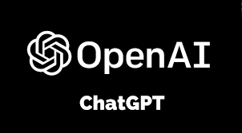

<!-- PROJECT LOGO -->
 
 

 <a href="https://github.com/AMM93/ChatGPTPython_Intro">
   

  
 

  
  <!-- ABOUT THE SCRIPT -->
  <h3 align="center">Intro ChatGPT Chatbot Template</h3>

  

    A very basic template to create your first Chatbot using GPT!
  

<!-- ABOUT THE SCRIPT -->
## About The Script

This will be an introduction to more complex scripts for OpenAI using Python

* 1. Register in OpenAI
* 2. Get an API 
* 3. Insert the API in code and start chatting with your personal AI!

<!-- LICENSE -->
## License

Distributed under the MIT License. See `LICENSE.txt` for more information.

<!-- CONTACT -->
## Contact

Antonio Moreno Martín - ant.moreno.martin@gmail.com

Project Link: [https://github.com/AMM93/ChatGPTPython_Intro)

